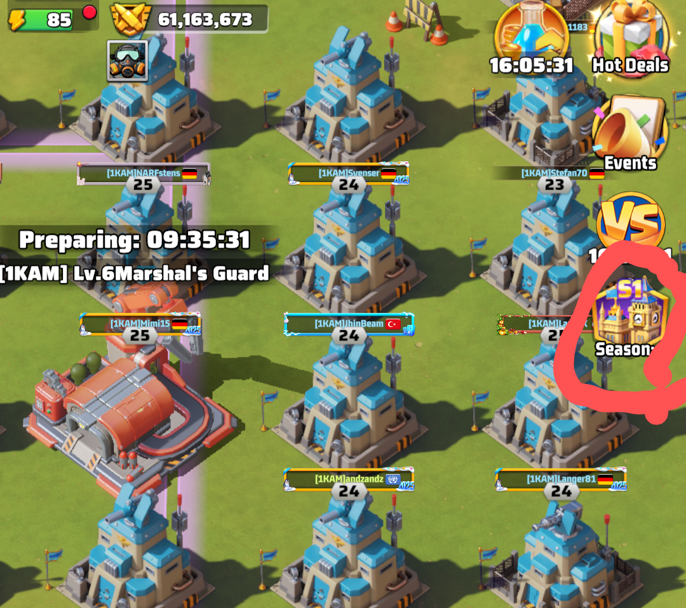
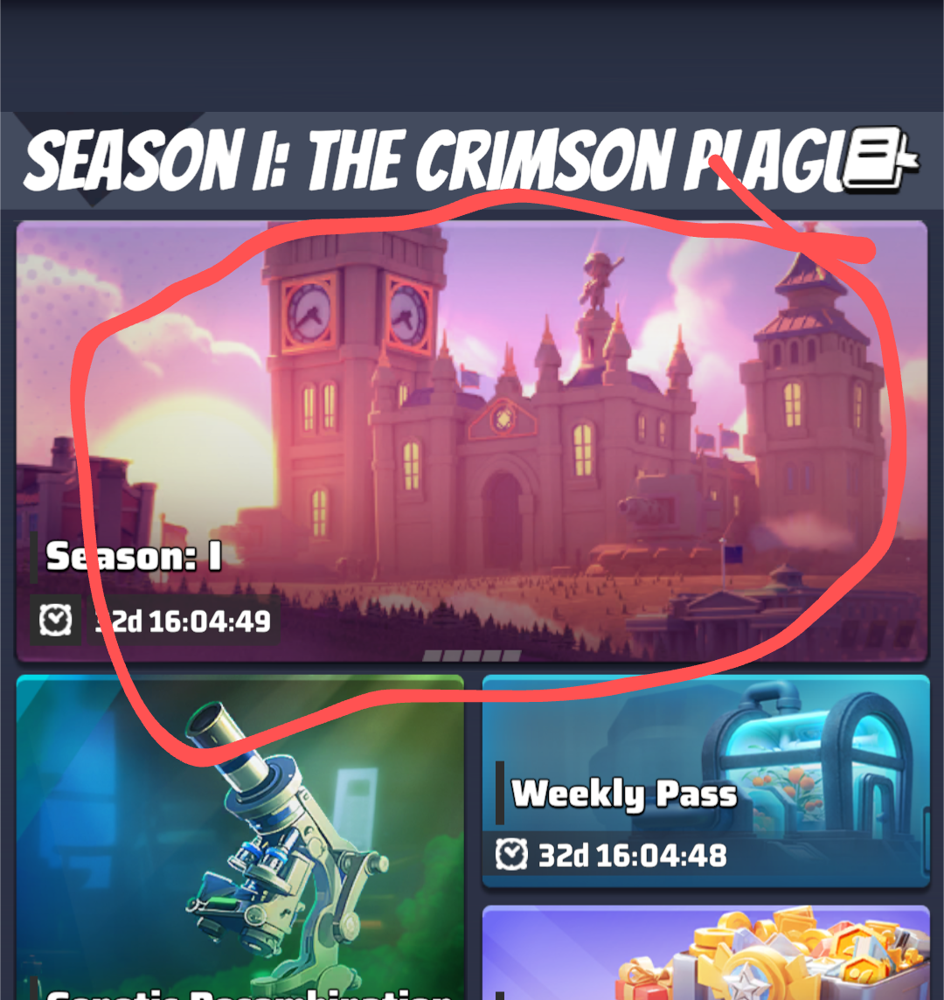
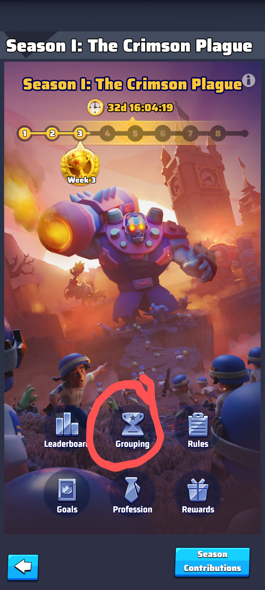
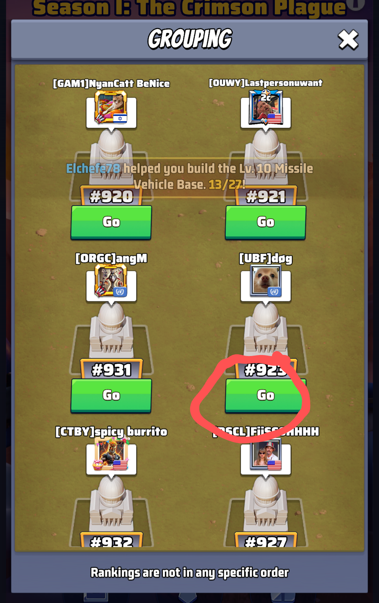

## Samstag

Jeden Samstag ist es möglich kostenlos zu teleportieren.

:warning: Es ist sinnvoll dabei ein aktives Schild zu haben. Das Schild bleibt erhalten falls man auf einen anderen Server teleportiert.

| Schritt | Bild |
| ---- | ----- |
| **auf den VS button klicken.** |  |
|**in dem alliance assault tab auf den Angriff Button klicken** |  |

Dies teleportiert einen kostenlos auf den anderen VS server. Um zurück zu kommen einfach den selben Schritten folgen.

:ninja: Dies ist eine tolle Methode um kostenlos zu teleportieren.

## Season 1

In der season 1 haben wir die Möglichkeit sogar jeden Tag kostenlos zu teleportieren.

| Schritt | Bild |
| ------- | ---- |
| **auf season 1 klicken** |  |
| **auf season 1 klicken** |  |
| **auf grouping klicken** |  |
| **server aussuchen und auf go klicken**|  |

:ninja: damit haben wir noch eine tolle Methode gefunden.
