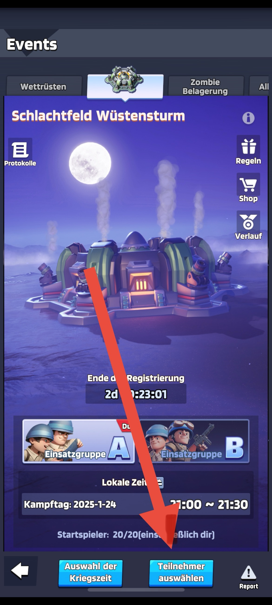
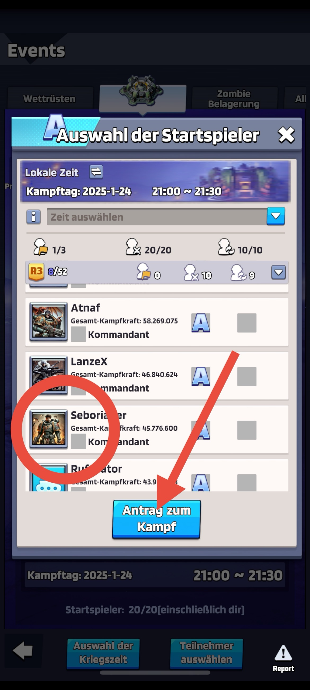

## How to apply for dessert storm

- Click on the Events button, then go to the "Battlefield Desert Storm" section.
- Click on "Participants" there. 
- A screen will appear where you can tick the box for "Main Combat Troop" or "Reserve/Replacement"
- You do not need to select a time
- :warning: Finally, you must press the "Application for Battle" button! 

:ninja: Only registrations via this system will be accepted
