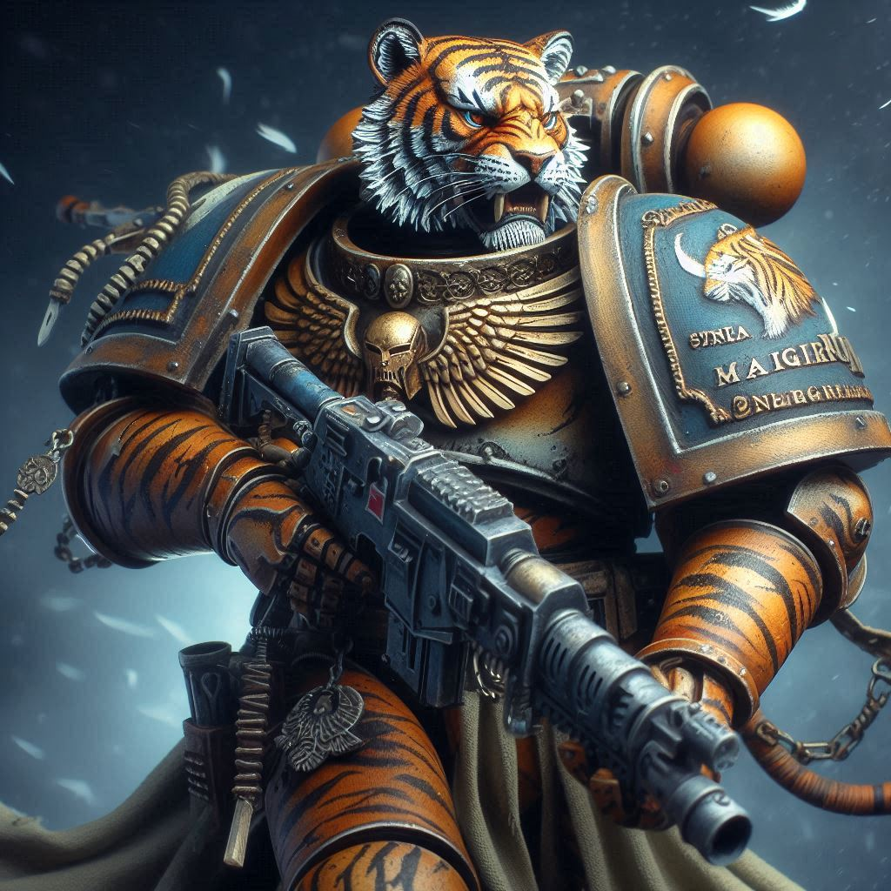
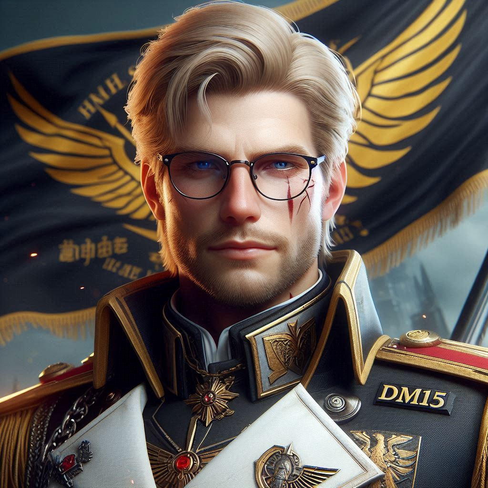

| **avatar** | **name** | **position** | **Beschreibung** |
| ---------- | -------- | ------------ | ---------------- |
|  | **steve0101** | **leader** | Steve ist wie ein Streichholz - kurz und schnell zündend! Geduld gehört nicht unbedingt zu seinen top-Qualifikationen, aber wenn man ihn wirklich braucht, ist er der Hulk der Hilfsbereitschaft und stürzt sich mit voller Power in den Einsatz!  |
|  | **Kaz Grey**| **warlord** | Kaz Grey, der Wachhund, der nicht nur bellen kann, sondern auch beißt - und sobald er das tut, beginnt es richtig zu brennen. Er ist der Alarm und das Feuer zugleich! |
|  | **SweetWW** | **Muse** | Sweet, loyal solange der Preis stimmt, mit Pferdekopf, großer Klappe und noch größerer Knare unterwegs! |
|  | **Brigade18** | **Buttler** | Brigade, ein grummelnder Bär, uner Fels in der Brandung. Wenn er bei einem Kommandanten Honig wittert, gibts kein Halten mehr und die Base wird schneller planiert als man "Stopp!" rufen kann |
|  | **Tania1702** | | Tania, die mit Präzision immer 3x12 trifft, doch in Gesprächen manchmal den Zielpunkt verfehlt - vielleicht liegt es daran, dass sie lieber auf Ziele schießt als auf Wörter? |
|  | **ak1291** | | AK, rekrutiert von Außerhalb, schnell aufgestiegen zum R4 und das völlig zu Recht! Karriereleiter wurde im Sprint genommen, genau wie feindliche Basen angegangen werden. |
|  | **Catville** | | Catville, ein Paradies für Katzen, ist verrückt nach Kisten wie alle Katzen - meow, meow, meow....klar soweit? |
|  | **Ancienthydra** | | Hydra, der Mann der nur wenig spricht, doch mit einer Nase wie ein Spürrhund alles riecht - er kam, er sah und er weiß wo die Diamanten liegen! |
|  | **Mimi15** | | Mimi, Gründerin, Mum und Geist in einem -  der wahre Beweis, dass Multitasking in jeder Lebenslage der wahre Trick ist. |
|  | **Seborianer** | | Seborianer, der Mann der Höflichkeit erfunden hat, Schriftsteller des Guten Wortes. Doch weh der Ruf zum Raid dann fliegen 2 Fäuste des Hallo - natti snatti |
|  | **andzandz** | | Andzandz, unser wandelndes Lexikon. Kann zwar die Hälfte der Wiki-Artikel auswendig, ist aber mit Zahlen auf dem Kriegsfuss |

## Ehrentafel

| **avatar** | **name** | **Details** | **Beschreibung** |
| ---------- | -------- | ------------ | ---------------- |
|  | **ChrisKes3112** | Chris war aktives **R4** Mitglied | ChrisKes, der Mann der wenigen Worte. Aber kein problem, seine Taten sind lauter als seine Sätze! |
|  | **mandi** | Mandi war aktives **R4** Mitglied | Mandi, immer ein offenes Ohr. Frust und schlechte Laune von Allianz Mitgliedern verreibt er mit seinen warmen Worten Worten sofort. |
